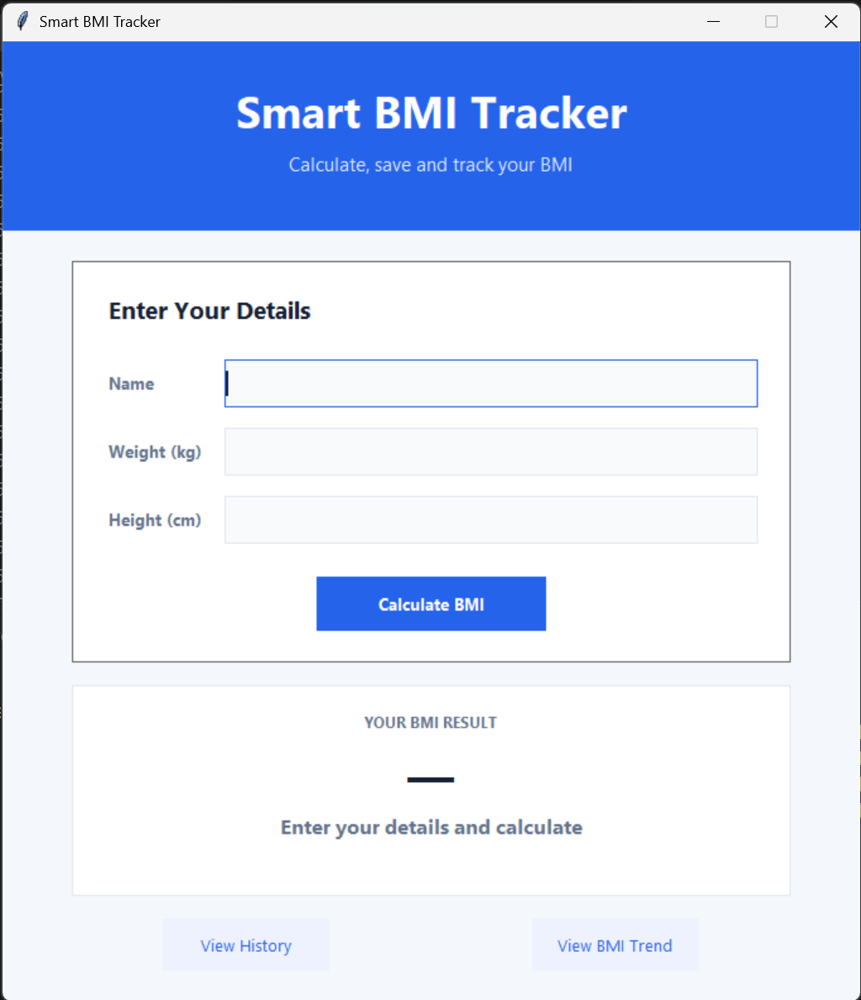
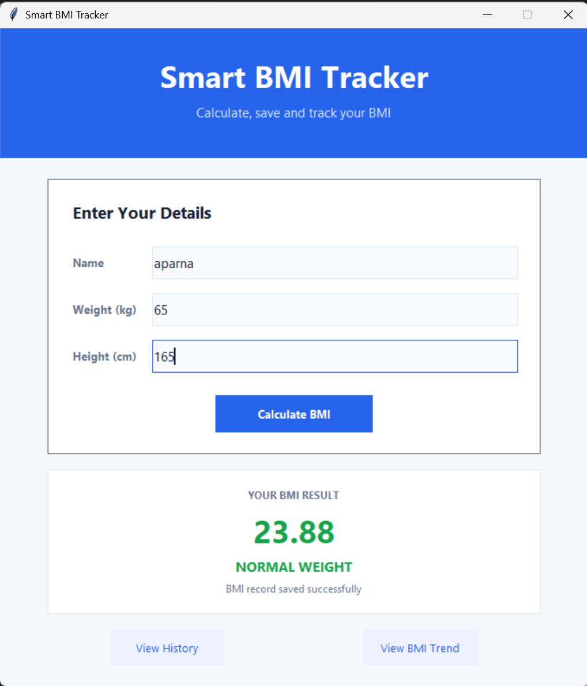
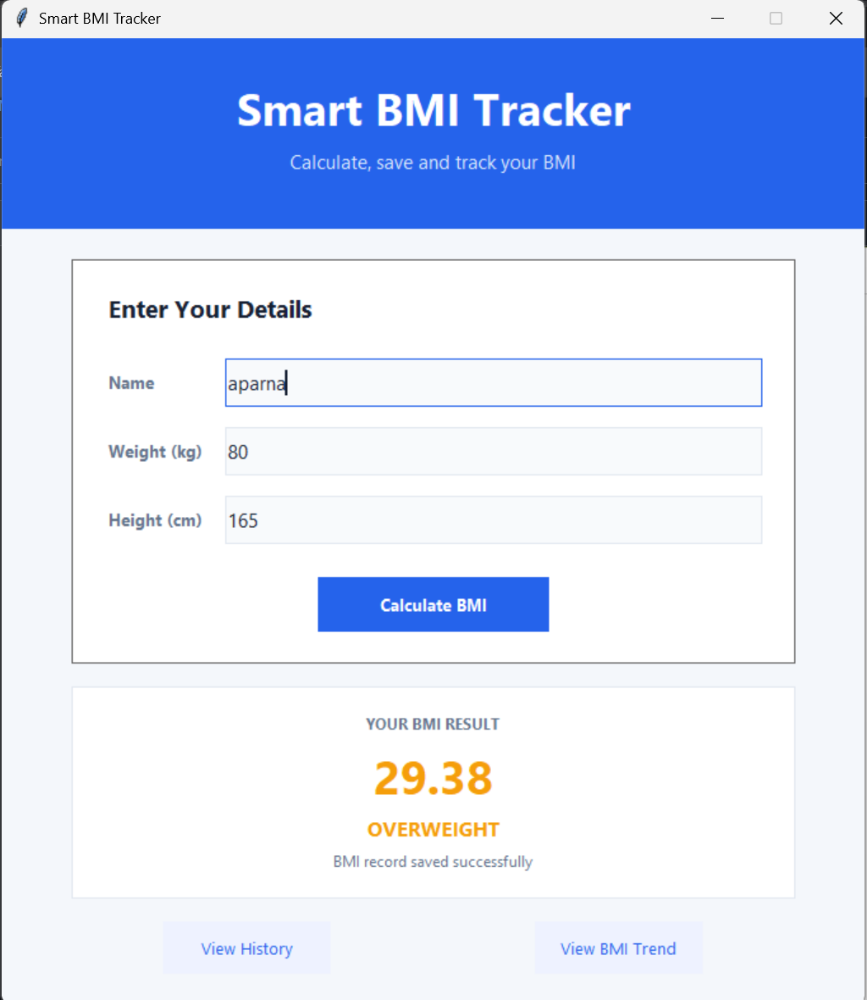
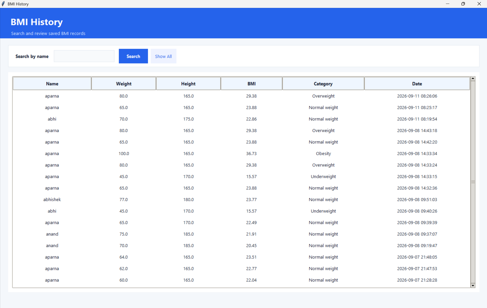
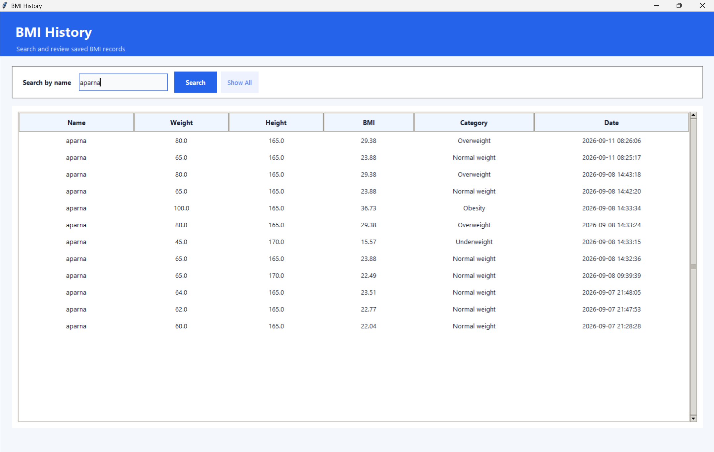
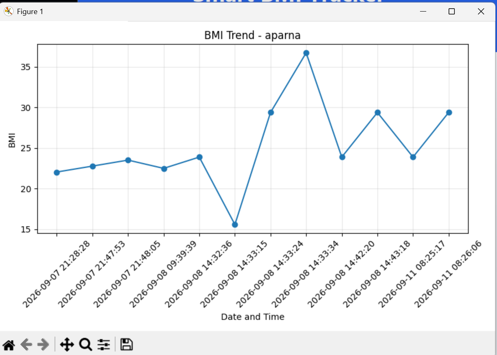
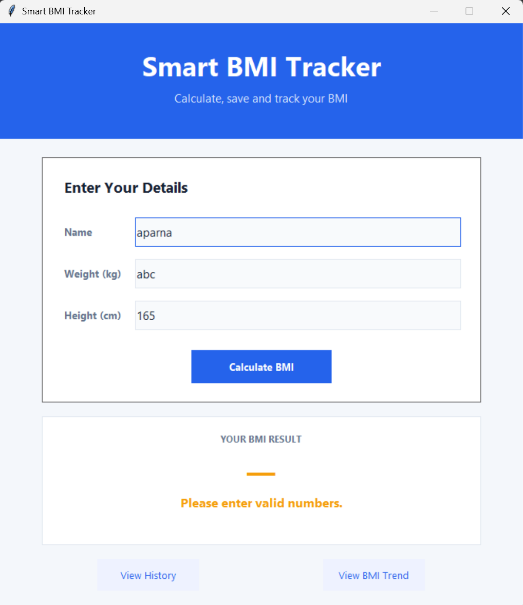

# Smart BMI Tracker

## Project Description

Smart BMI Tracker is a desktop BMI calculator and tracker developed using Python and Tkinter. It calculates BMI, identifies the BMI category, stores records in an SQLite database, and allows users to view, search, and graph BMI history.

This project was developed for the Oasis Infobyte Python Programming Internship, Task 2 – Advanced BMI Calculator.

## Features

- Calculate BMI using weight and height
- Classify BMI into four categories
- Validate user input
- Display colour-coded BMI results
- Support multiple named users
- Store records in SQLite
- Display BMI history in a table
- Filter history by user name
- Display user-specific BMI trend graphs
- Visualize BMI trends using Matplotlib
- Handle database errors
- Provide a Tkinter graphical user interface

## Technologies Used

- Python
- Tkinter
- SQLite
- Matplotlib

## Project Structure

```
Python-Task2-BMICalculator/
│
├── main.py
├── bmi_logic.py
├── database.py
├── requirements.txt
├── README.md
└── .gitignore
```

- `main.py` – Provides the Tkinter interface, handles user input, displays results, and connects the application components.
- `bmi_logic.py` – Contains BMI calculation and category classification logic.
- `database.py` – Handles SQLite database creation and BMI record operations.
- `requirements.txt` – Lists the external Python packages required by the project.
- `README.md` – Contains project documentation and setup instructions.
- `.gitignore` – Specifies files that should not be committed to GitHub.

The `venv`, `__pycache__`, and `bmi_tracker.db` files are local or generated files and should not be committed according to `.gitignore`.

## How the Application Works

1. The user enters a name.
2. The user enters weight in kilograms.
3. The user enters height in centimeters.
4. The user clicks **Calculate BMI**.
5. The application calculates the BMI.
6. The BMI category is determined.
7. The result is displayed using a category-dependent colour.
8. The record is saved to the SQLite database.
9. The user can view saved BMI history.
10. The user can search history by name.
11. The user can view a selected user's BMI trend.

## BMI Formula

```text
BMI = weight (kg) / height (m)²
```

The application converts height from centimeters to meters before calculating BMI.

## BMI Categories

- **Underweight:** BMI below 18.5
- **Normal weight:** BMI from 18.5 to below 25
- **Overweight:** BMI from 25 to below 30
- **Obesity:** BMI 30 or above

## Input Validation

The application validates:

- Empty names
- Invalid or non-numeric weight and height values
- Zero or negative values
- Unrealistic weight and height values

Helpful error messages are displayed when invalid data is entered.

## Database

SQLite is used to store persistent BMI records.

Each record contains:

- Name
- Weight
- Height
- BMI
- BMI category
- Recorded date and time

The database is created automatically when the application starts. Database read and write errors are handled gracefully and reported to the user.

## BMI History

The application displays saved records in a Tkinter `Treeview` table. Users can filter the history by entering a name, allowing them to view records for a specific user.

## BMI Trend

Matplotlib is used to display a line graph of a selected user's BMI measurements over time. The graph shows the recorded BMI values and their corresponding dates and times.

## Screenshots
















## Installation and Setup

1. Clone the repository:

   ```bash
   git clone https://github.com/Aparna-42/OIBSIP.git

2. Open the project folder:
   
   cd Python-Task2-BMICalculator

3. Create a virtual environment:

   python -m venv venv

4. Activate the virtual environment:

   .\venv\Scripts\Activate.ps1

5. Install the dependencies:

   pip install -r requirements.txt

6. Run the application:

   python main.py

The SQLite database is created automatically when the application starts.

## Usage

1. Start the application.
2. Enter the user's name.
3. Enter weight in kilograms.
4. Enter height in centimeters.
5. Click Calculate BMI.
6. Review the calculated BMI and category.
7. Open the history view to see saved records.
8. Search for records by user name.
9. Enter a user's name to view their BMI trend graph.

## Error Handling

The application checks user input before performing calculations. It displays messages for missing, invalid, zero, negative, or unrealistic values.

SQLite database read and write errors are also handled without immediately terminating the application.

## Project Purpose
This project was developed as part of the Oasis Infobyte Python Programming Internship, Python Programming Track, Task 2 – BMI Calculator.

## Author
Aparna Sunil T P