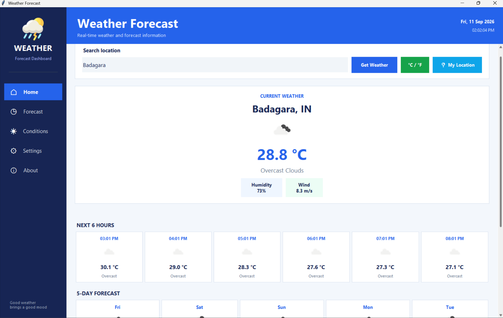
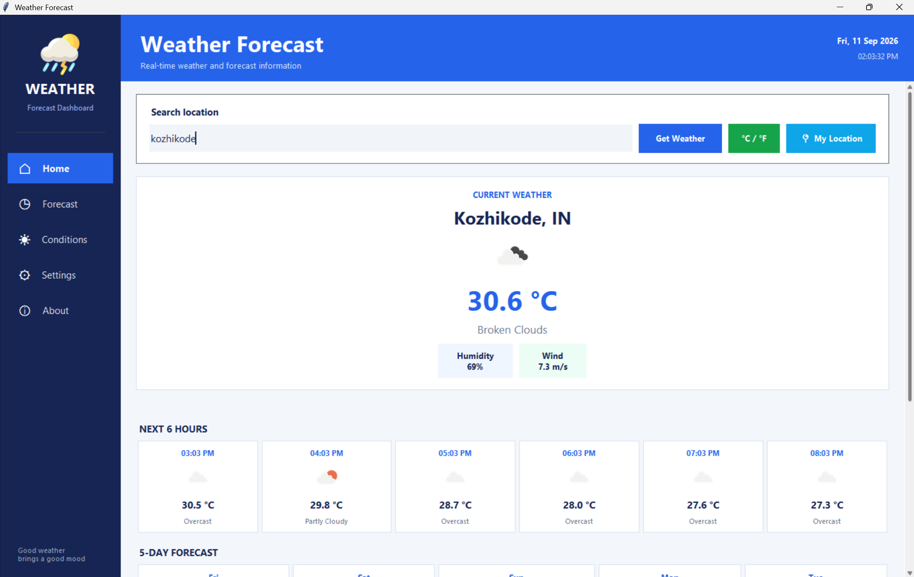
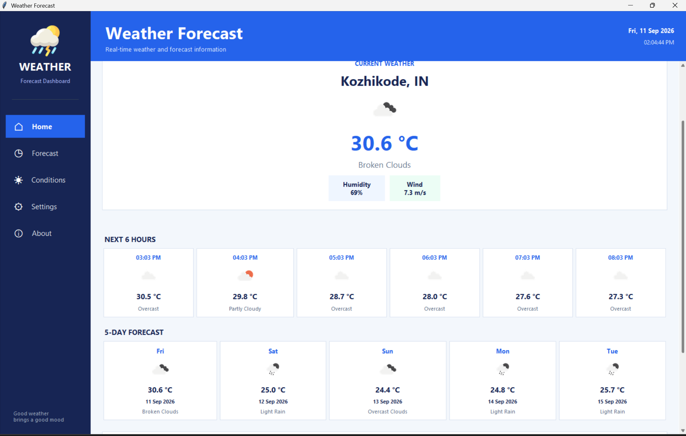
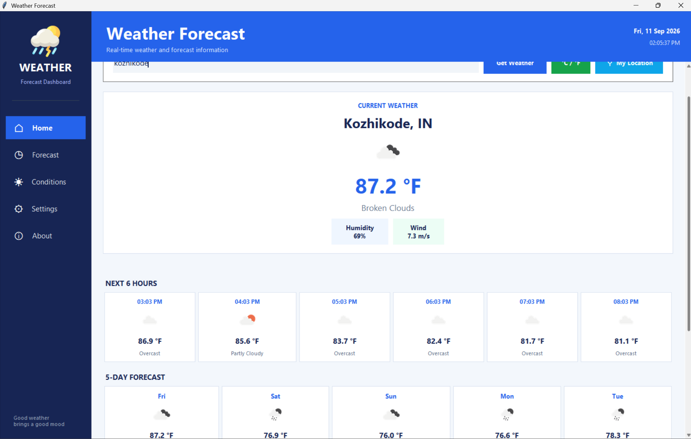
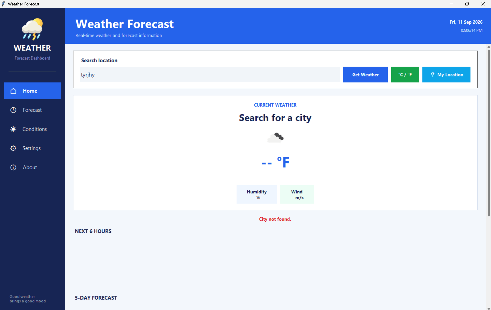
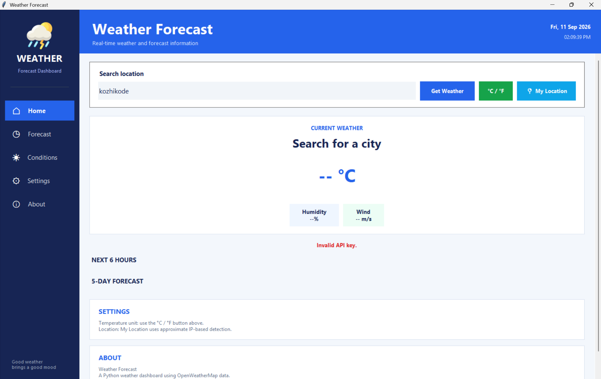

# Basic Weather App

## Oasis Infobyte Internship – Python Programming

### Task 4 – Basic Weather App (Advanced)

## Project Overview

This project is an advanced graphical weather application developed using Python. It fetches real-time weather information for a user-specified city using the OpenWeatherMap API and displays current weather conditions along with hourly and daily forecasts.

The application provides a user-friendly GUI, weather icons, temperature unit conversion, forecast information, and graphical error handling.

## Features

### Current Weather

- Search weather by city name
- Display current temperature
- Display weather condition
- Display humidity percentage
- Display wind speed
- Display weather icon

### Forecast

- Next 6 hours weather forecast
- Next 5 days daily forecast
- Weather icons for forecast conditions

### Temperature Units

- Celsius (°C)
- Fahrenheit (°F)
- Switch between Celsius and Fahrenheit without making another API request

### Error Handling

- Empty city input validation
- City not found error
- Invalid API key error
- Network connection error
- Request timeout error
- Error messages displayed inside the GUI

## Technologies Used

- Python
- Tkinter
- Requests
- Pillow (PIL)
- python-dotenv
- OpenWeatherMap API

## Project Structure 

```text
Python-Task4-WeatherApp/
│
├── screenshots/
│   ├── 01_main_weather.png
│   ├── 02_hourly_forecast.png
│   ├── 03_five_day_forecast.png
│   ├── 04_fahrenheit.png
│   ├── 05_invalid_city.png
│   └── 06_invalid_api_key.png
├── main.py
├── weather_api.py
├── weathericon.png
├── requirements.txt
├── .gitignore
├── .env                 # Local only, not uploaded to GitHub
└── README.md

```

## API key setup

1. Create an OpenWeatherMap API key.
2. Create a .env file in the project directory.
3. Add the following:
   OPENWEATHER_API_KEY=your_api_key_here
4. Install the required dependencies.
5. Run the application.

## Installation and Running

Create and activate a virtual environment:
python -m venv venv

Activate the virtual environment on Windows:
venv\Scripts\activate

Install dependencies:
pip install -r requirements.txt

Run the application:
python main.py

## Screenshots













## Oasis Infobyte Task Requirements Covered

- GUI window with city input field and Get Weather button
- Real-time weather data using OpenWeatherMap API
- Weather condition icons
- Next 6 hours forecast
- Next 5 days forecast
- Celsius/Fahrenheit unit toggle
- Input validation
- City not found handling
- Network timeout handling
- Invalid API key handling
- Error messages displayed inside the GUI

## Security

The OpenWeatherMap API key is stored in a .env file and excluded from version control using .gitignore.

The API key should never be committed to the GitHub repository.

## Internship

Organization: Oasis Infobyte
Program: AICTE Oasis Infobyte Internship Program
Track: Python Programming
Task: Task 4 – Basic Weather App
Level: Advanced
