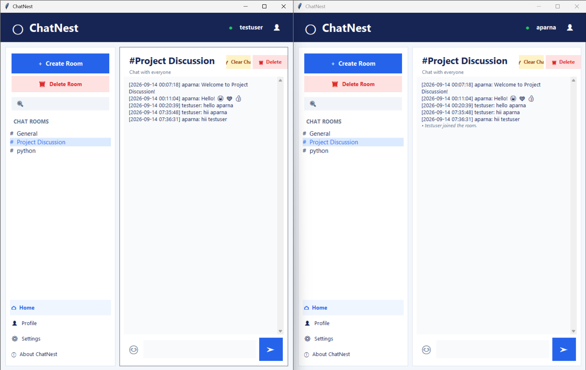
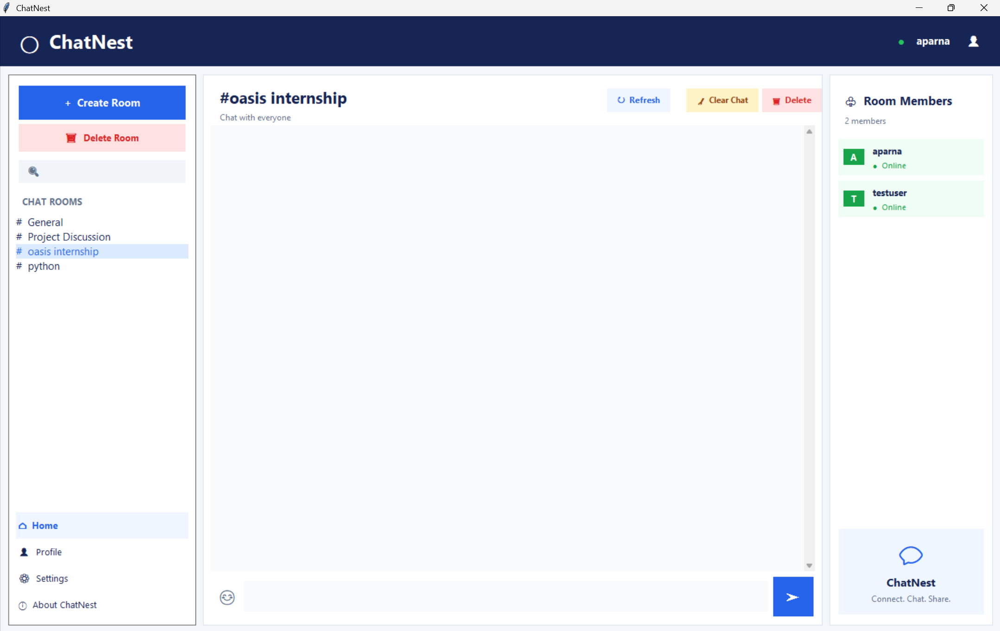
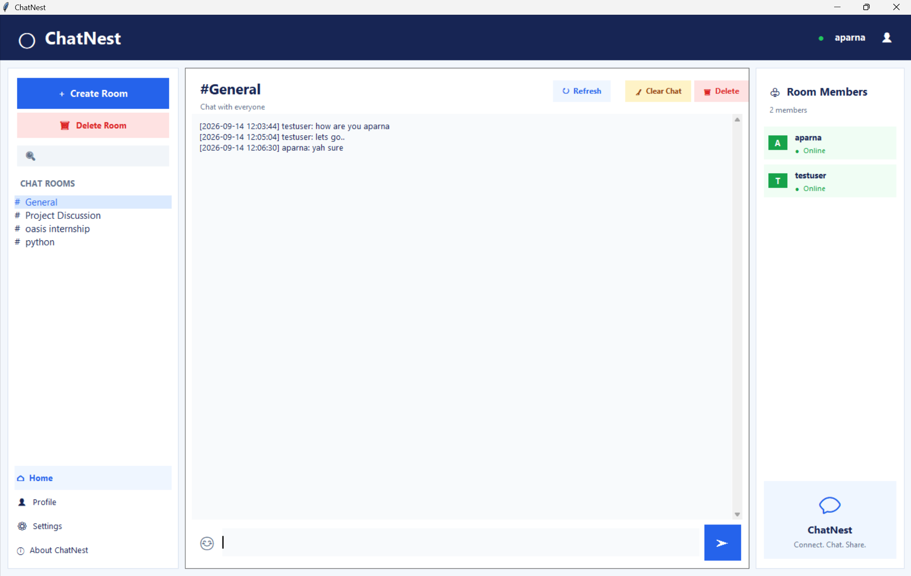
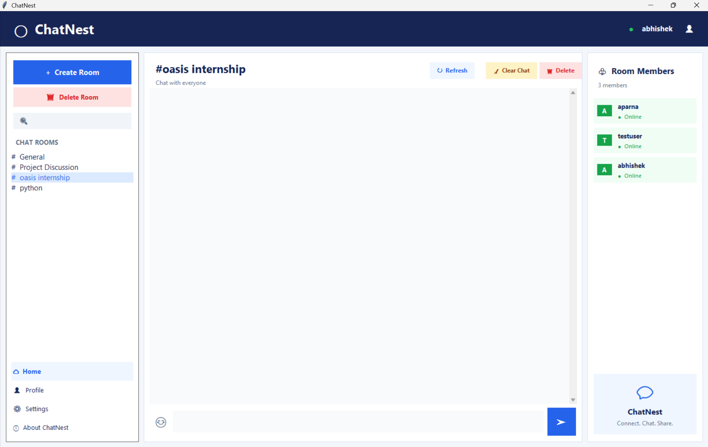
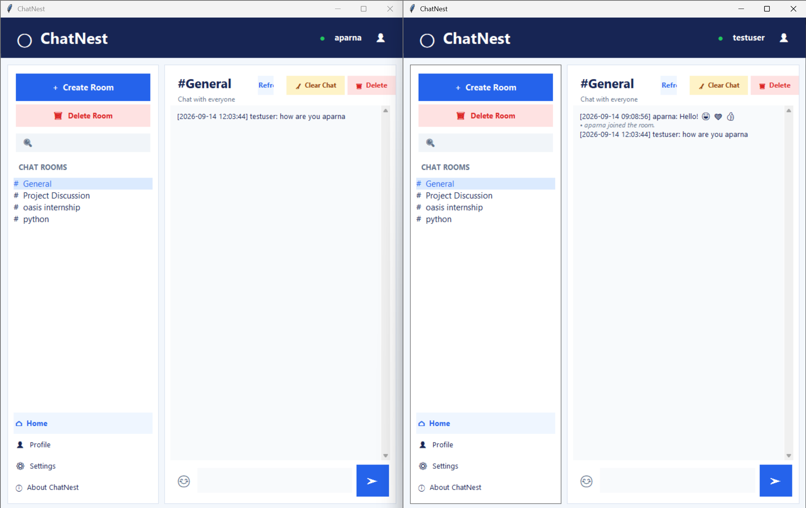
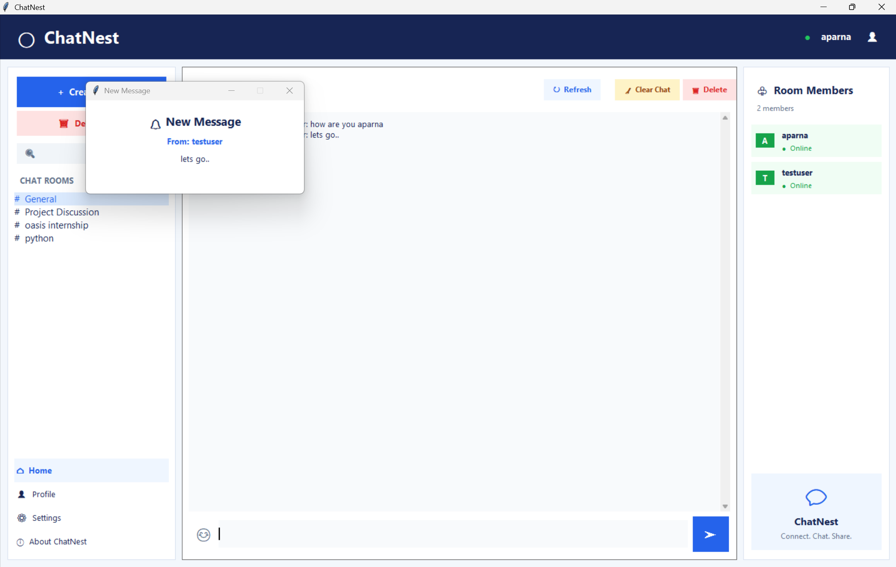
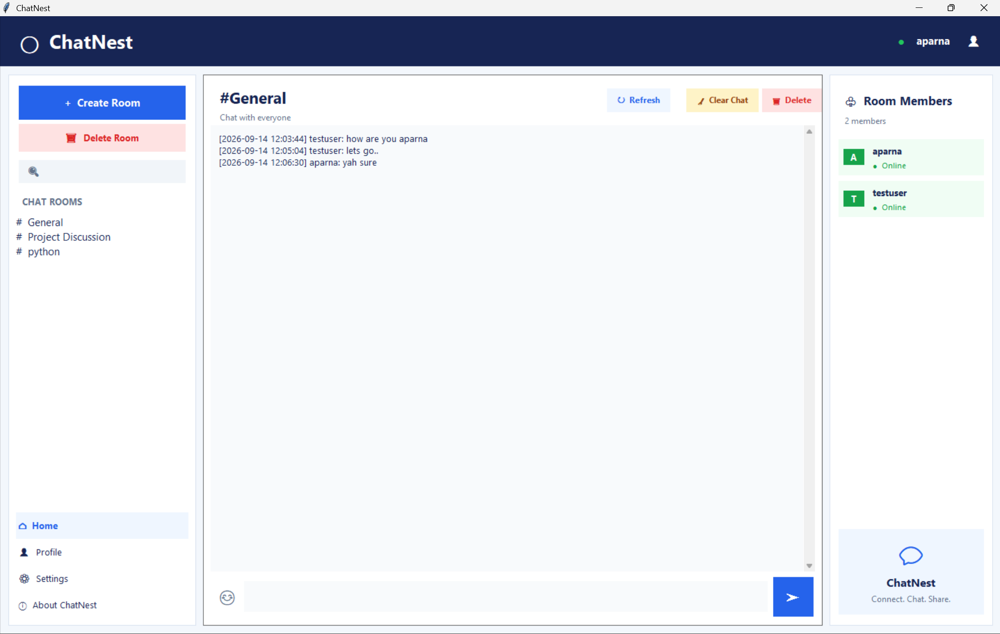

ChatNest is a real-time chat application built using Python, enabling multiple users to communicate through named chat rooms. It includes a graphical user interface that offers user authentication, real-time messaging, message history, support for emojis, desktop notifications, and features for managing messages per user.

This project was created as part of the Oasis Infobyte Python Programming Internship -- Task 5.

------------------------------------------------------------------------

## Features

### Authentication

- Users can register and log in
- Authentication is done using a username and password
- Passwords are stored securely using PBKDF2-HMAC-SHA256 with a unique salt
- The system automatically upgrades older password records that use SHA-256 when needed

### Real-Time Messaging

- Real-time communication between users is handled via Python sockets
- Each message includes a timestamp
- Multiple users can join the same chat room and exchange messages
- Users receive notifications when someone joins or leaves a chat room
- The system handles user disconnections smoothly

### Multiple Chat Rooms

- A General room is available by default
- Users can create custom named chat rooms
- Users can join different rooms as needed
- Messages are separated between rooms
- The list of online users in a room is shown
- Custom rooms can be deleted
- Users in a deleted room are automatically moved to the General room

### Message History

- Previous messages are saved in an SQLite database
- When a user joins a room, the chat history for that room is automatically loaded
- Messages include the username, timestamp, and message text

### Message Management

- Users can delete any individual message from their own view
- Users can clear the entire chat history from their own view
- These actions do not affect other users
- The original messages remain available to other users

### Emoji Support

ChatNest allows the use of emoji shortcodes, which are converted into Unicode emojis.

Examples:

`:smile:` → 😄
`:heart:` → ❤️
`:thumbsup:` → 👍

### Desktop Notifications

- A desktop notification is shown when a new message arrives and the application is not in focus

### Graphical User Interface

- The interface is built using Tkinter
- It includes a chat room navigator
- A panel showing current room members
- Tools for sending messages
- Features like refresh, delete message, clear chat, and delete room
- Sections for profile, settings, and about information

------------------------------------------------------------------------

## Technologies Used

- Python
- Tkinter
- Socket Programming
- Threading
- SQLite3
- JSON
- PBKDF2-HMAC-SHA256
- Windows Desktop Notifications

All of the core features are implemented using Python's standard libraries.

------------------------------------------------------------------------

## Project Structure

```
Python-Task5-ChatApplication/
│
├── server.py
├── client.py
├── database.py
├── chat_utils.py
├── README.md
├── .gitignore
└── screenshots/
    ├── 01_login_registration.png
    ├── 02_multiple_users.png
    ├── 03_create_room.png
    ├── 04_realtime_chat.png
    ├── 05_multiple_rooms.png
    ├── 06_message_history.png
    ├── 07_room_members.png
    ├── 08_emoji_support.png
    ├── 09_clear_chat.png
    ├── 10_delete_message.png
    ├── 11_notification.png
    └── 12_delete_room.png
```

&gt; The `chat_app.db` file is automatically created when the application starts.
It should not be added to GitHub if it contains personal test data.

------------------------------------------------------------------------

## Database

ChatNest uses SQLite3 for storing data locally.

The database includes tables for:

- Users
- Chat rooms
- Messages
- Hidden messages

### User Data

User login information is stored in the SQLite database.
Passwords are stored in a hashed format.

ChatNest uses PBKDF2-HMAC-SHA256 with a randomly generated salt and multiple iterations for securing passwords.

### Message Storage

Each message is stored in the database with:

- Unique message ID
- Room ID
- Username
- Message text
- Timestamp

When a user enters a chat room, the application retrieves the message history for that room and displays it in the chat interface.

### Per-User Message Deletion

When a user deletes a message, the system does not remove it from the database globally.

Instead, ChatNest keeps a record that the message is hidden for that particular user.
This means:

- User A can choose to hide a message from their view
- User B will still be able to see the same message
- The original message remains in the database

The same method is used for the Clear Chat function.

------------------------------------------------------------------------

## Security and Privacy

ChatNest uses password hashing rather than storing passwords in plain text.

However, this application is designed as an internship project and has certain security limitations.

### What is Protected

- Passwords are hashed with PBKDF2-HMAC-SHA256 and are not stored as plain text

### What is NOT Encrypted

- Chat messages are stored in readable text format in the local SQLite database
- Network communication currently uses regular sockets and does not include TLS/SSL encryption for security

The application does not offer end-to-end encryption.

Therefore, the local SQLite database needs to be safeguarded against unauthorized access.


This project is meant for educational purposes and for demonstration on a local machine, and it is not recommended for use in a production environment.


------------------------------------------------------------------------

## Requirements

- Python 3.x
- Tkinter
- Windows operating system for desktop notification functionality

No additional Python libraries are needed for the main application.


------------------------------------------------------------------------

## How to Run

### 1.
Clone the Repository

```bash
git clone https://github.com/Aparna-42/OIBSIP.git
```

### 2.
Navigate to the Project

```bash
cd OIBSIP/Python-Task5-ChatApplication
```

### 3.
Start the Server

Open a terminal and execute:

```bash
python server.py
```

The server will listen for client connections on:

```text
127.0.0.1:5555
```

### 4.
Start the Client

Launch another terminal and run:

```bash
python client.py
```

To test with multiple users, run `client.py` again in a different terminal or window and log in with a separate account.


------------------------------------------------------------------------

## Application Workflow

```text
Start Server
     │
     ▼
Start Client
     │
     ▼
Register / Login
     │
     ▼
Select or Create Chat Room
     │
     ▼
Join Room
     │
     ▼
Load Message History
     │
     ▼
Send / Receive Messages
     │
     ├── Emoji Conversion
     ├── Desktop Notification
     ├── Delete Message for Yourself
     ├── Clear Chat for Yourself
     └── Delete Chat Room
```

------------------------------------------------------------------------

## Screenshots

### 1.
Login and Registration

### 2.
Multiple Users

### 3.
Create Room

### 4.
Real-Time Messaging

### 5.
Multiple Chat Rooms

### 6.
Message History

### 7.
Room Members

### 8.
Emoji Support

### 9.
Clear Chat

### 10.
Delete Message

### 11.
Desktop Notification

### 12.
Delete Room

------------------------------------------------------------------------

## Task Information

- Internship: Oasis Infobyte Internship Program
- Track: Python Programming
- Task: Task 5 -- Chat Application
