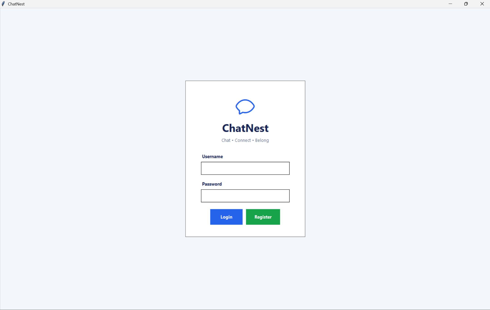
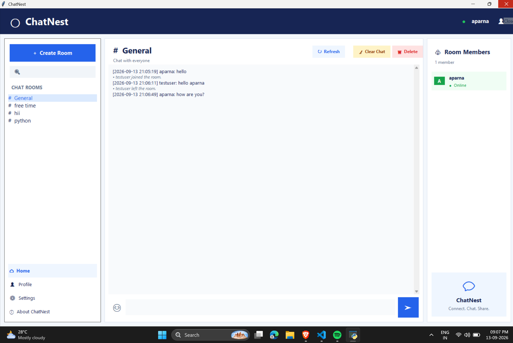
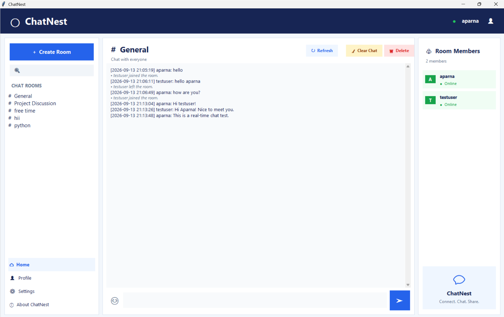
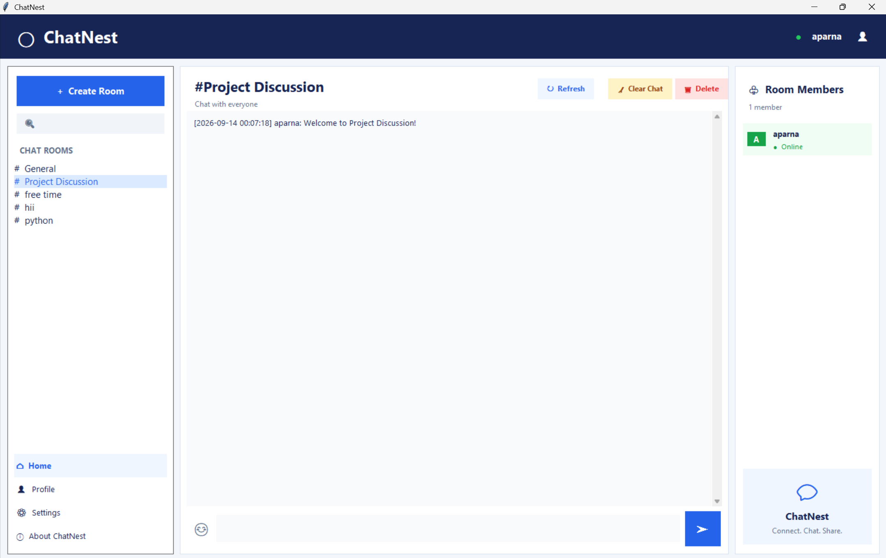
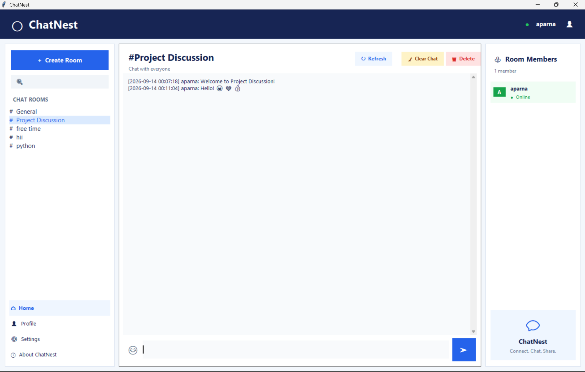
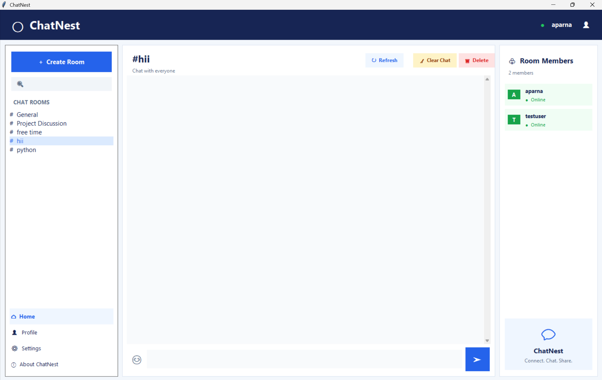
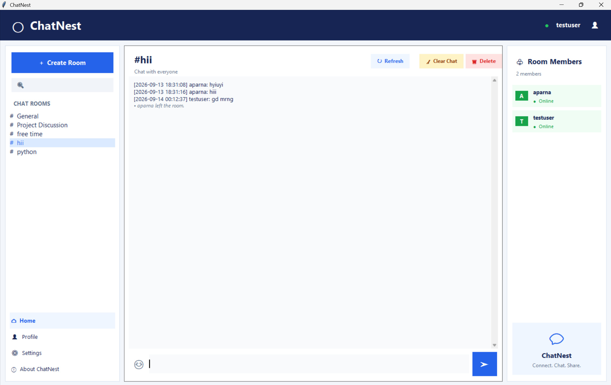
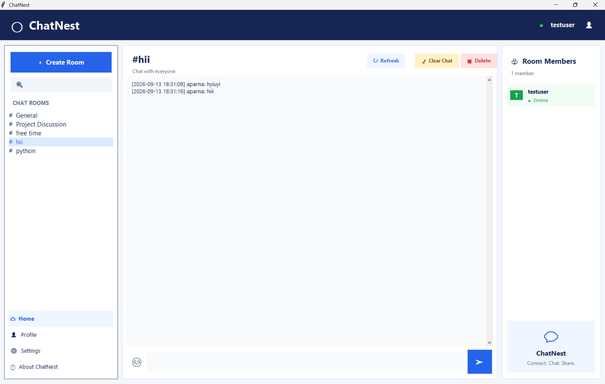
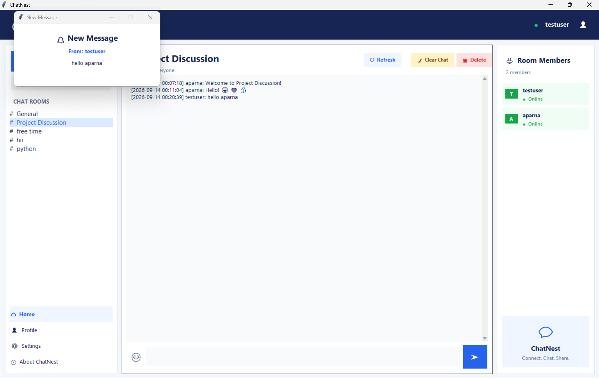

# ChatNest – Real-Time Multi-Room Chat Application

ChatNest is a Python-based real-time chat application that allows multiple users to communicate through named chat rooms. It provides a graphical user interface with user authentication, real-time messaging, message history, emoji support, desktop notifications, and per-user message management.

This project was developed as part of the **Oasis Infobyte Python Programming Internship – Task 5**.

---

## Features

### Authentication
- User registration and login
- Username and password authentication
- Passwords stored using PBKDF2-HMAC-SHA256 hashing with a unique salt
- Automatic upgrade of older SHA-256 password records when applicable

### Real-Time Messaging
- Real-time bidirectional communication using Python sockets
- Timestamped messages
- Multiple users can communicate in the same room
- System notifications when users join or leave a room
- Graceful user disconnection

### Multiple Chat Rooms
- General room available by default
- Create custom named chat rooms
- Join different rooms
- Messages are isolated between rooms
- Online room member list

### Message History
- Previous messages are stored in SQLite
- Message history is automatically loaded when joining a room
- Messages include username, timestamp, and message content

### Message Management
- Delete an individual message for the current user
- Clear the current room's chat history for the current user
- Other users' message history is not affected by another user's delete or clear action

### Emoji Support
ChatNest supports emoji shortcodes and converts them into Unicode emojis.

Examples:

`:smile:` → 😄  
`:heart:` → ❤️  
`:thumbsup:` → 👍

### Desktop Notifications
- Displays a desktop notification when a new message is received while ChatNest is not focused.le ChatNest is not focused.

### Graphical User Interface
- Built with Tkinter
- Chat room navigation
- Room member panel
- Message input and send controls
- Refresh, Delete, and Clear Chat actions
- Profile, Settings, and About sections

---

## Technologies Used

- **Python**
- **Tkinter**
- **Socket Programming**
- **Threading**
- **SQLite3**
- **JSON**
- **PBKDF2-HMAC-SHA256**
- **Windows Desktop Notifications**

All core functionality uses Python's standard library.

---

## Project Structure

```text
Python-Task5-ChatApplication/
│
├── server.py
├── client.py
├── database.py
├── chat_utils.py
├── README.md
├── .gitignore
└── screenshots/
    ├── 01_login_registration.png
    ├── 02_main_chat.png
    ├── 03_realtime_chat.png
    ├── 04_multiple_rooms.png
    ├── 05_create_room.png
    ├── 06_message_history.png
    ├── 07_room_members.png
    ├── 08_emoji_support.png
    ├── 09_clear_chat.png
    ├── 10_other_user_messages.png
    ├── 11_delete_message.png
    └── 12_notification.png

```
chat_app.db is created automatically when the application is initialized. It should not be committed to GitHub if it contains personal test data.

## Database

ChatNest uses SQLite3 for local data storage.

The database contains tables for:

Users
Chat rooms
Messages
Hidden messages

## User Data

User credentials are stored in the SQLite database. Passwords are not stored as plain text.

ChatNest uses:

PBKDF2-HMAC-SHA256

with a randomly generated salt and multiple iterations for password hashing.

## Message Storage

Messages are stored in the SQLite database with:

Message ID
Room ID
Username
Message content
Timestamp

When a user joins a room, the application retrieves the stored messages for that room and displays them in the chat interface.

## Per-User Message Deletion

When a user deletes a message, the original message is not removed globally.

Instead, ChatNest records that the specific message is hidden for that particular user.

Therefore:

User A can delete a message from their view.
User B can still see the same message.
The original message remains stored in the database.

The same approach is used for the Clear Chat feature.

## Security and Privacy

ChatNest uses password hashing rather than storing passwords in plain text.

However, this application is designed as an internship project and has some security limitations.

## What is protected
Passwords are hashed using PBKDF2-HMAC-SHA256 with a unique salt.
Passwords are not stored as plain text.
## What is NOT encrypted
Chat messages are stored as readable text in the local SQLite database.
Network communication currently uses regular sockets and is not protected with TLS/SSL encryption.
The application does not provide end-to-end encryption.
The local SQLite database should therefore be protected from unauthorized access.

This project is intended for learning and local demonstration purposes rather than production use.
## Requirements

- Python 3.x
- Tkinter
- Windows operating system for desktop notification support

No external Python packages are required for the core application.
## How to Run
1. Clone the Repository
git clone https://github.com/Aparna-42/OIBSIP.git
2. Navigate to the Project
cd OIBSIP/Python-Task5-ChatApplication
3. Start the Server

Open a terminal and run:

python server.py

The server listens for client connections on:

127.0.0.1:5555
4. Start the Client

Open another terminal and run:

python client.py

For testing multiple users, run client.py again in another terminal/window and log in with a different account.

## Application Workflow
Start Server
     │
     ▼
Start Client
     │
     ▼
Register / Login
     │
     ▼
Select or Create Chat Room
     │
     ▼
Join Room
     │
     ▼
Load Message History
     │
     ▼
Send / Receive Messages
     │
     ├── Emoji Conversion
     ├── Desktop Notification
     ├── Delete Message
     └── Clear Chat

## Screenshots

### 1. Login and Registration


### 2. Main Chat Interface


### 3. Real-Time Messaging


### 4. Create and Manage Rooms


### 5. Message History


### 6. Emoji Support


### 7. Clear Chat


### 8. Per-User Message Visibility


### 9. Delete Message


### 10. Desktop Notification
 

## Task Information

Internship: Oasis Infobyte Internship Program
Track: Python Programming
Task: Task 5 – Chat Application
Project: ChatNest – Real-Time Multi-Room Chat Application

## Author

Aparna Sunil T P